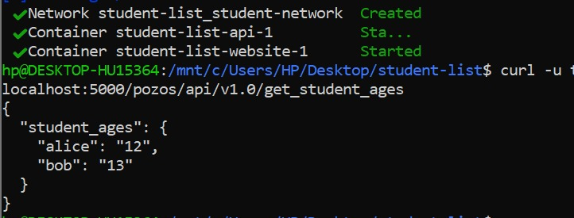
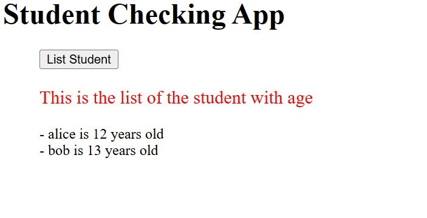
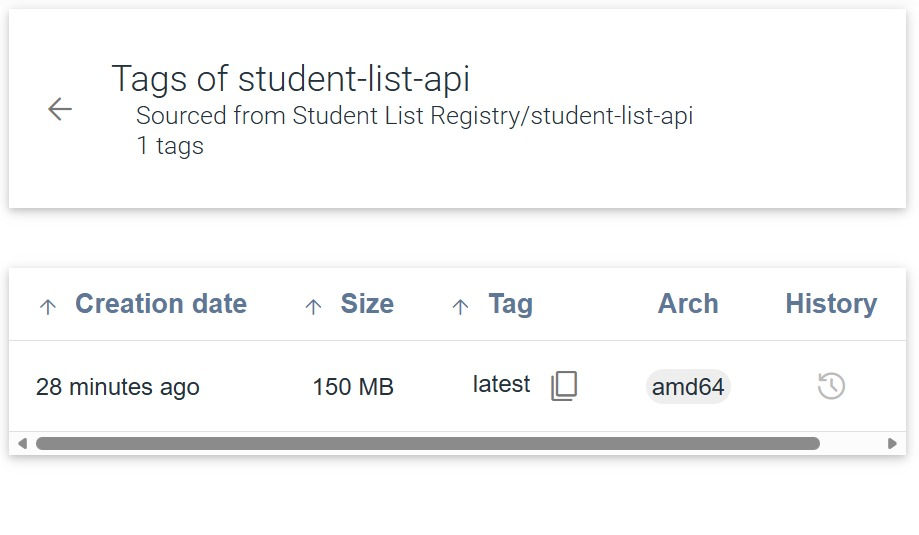

# Student List – Mini Projet Docker

> **Auteur** : mmafouotayo-arch  
> **Entreprise** : CCNTechnologies  
> **Objectif** : Conteneuriser une application de liste d'étudiants avec Docker (API Flask + Frontend PHP)

---

## Architecture

```
[Navigateur] → [PHP/Apache :8080] → [API Flask :5000] → [student_age.json]
```

Deux services Docker communiquent via un réseau bridge interne `student-network` :
- **api** : API REST Flask avec authentification basique (user: `toto`, password: `python`)
- **website** : Interface web PHP/Apache

---

## Structure du projet

```
student-list/
├── docker-compose.yml           # Orchestration des deux services principaux
├── docker-compose.registry.yml  # Registre privé Docker + interface web
├── simple_api/
│   ├── Dockerfile               # Image de l'API Flask
│   ├── student_age.py           # Code source de l'API
│   ├── student_age.json         # Données des étudiants
│   └── requirements.txt         # Dépendances Python
└── website/
    └── index.php                # Interface web PHP
```

---

## Partie 1 – Build et Test (7 points)

### Dockerfile

```dockerfile
FROM python:3.11-slim
LABEL maintainer="CCNTechnologies <contact@ccntechnologies.cm>"

RUN apt-get update -y && \
    apt-get install -y gcc python3-dev libsasl2-dev libldap2-dev libssl-dev && \
    apt-get clean && rm -rf /var/lib/apt/lists/*

COPY student_age.py /student_age.py
COPY requirements.txt /requirements.txt
RUN pip3 install -r /requirements.txt

RUN mkdir -p /data
VOLUME /data

EXPOSE 5000
CMD ["python3", "./student_age.py"]
```

**Explications :**
- Image de base légère `python:3.11-slim`
- `gcc` ajouté pour compiler `python-ldap`
- Le dossier `/data` est déclaré en volume pour la persistance du fichier JSON
- Port `5000` exposé pour l'API

### Build et lancement

```bash
docker-compose up -d --build
```

### Test de l'API

```bash
curl -u toto:python -X GET http://localhost:5000/pozos/api/v1.0/get_student_ages
```

**Résultat :**



---

## Partie 2 – Infrastructure As Code (5 points)

### docker-compose.yml

```yaml
version: '3.8'

services:
  api:
    image: student-list-api:latest
    build: ./simple_api
    volumes:
      - ./simple_api/student_age.json:/data/student_age.json
    ports:
      - "5000:5000"
    networks:
      - student-network

  website:
    image: php:apache
    environment:
      - USERNAME=toto
      - PASSWORD=python
    volumes:
      - ./website:/var/www/html
    ports:
      - "8080:80"
    depends_on:
      - api
    networks:
      - student-network

networks:
  student-network:
    driver: bridge
```

**Explications :**
- `depends_on` garantit que l'API démarre avant le site web
- Les credentials sont injectés via variables d'environnement
- Le réseau `student-network` permet la communication entre les conteneurs
- `./website:/var/www/html` monte le fichier PHP dans Apache

### Résultat – Site web



---

## Partie 3 – Registre Docker Privé (4 points)

### Lancement du registre

```bash
docker-compose -f docker-compose.registry.yml up -d

docker tag student-list-api:latest localhost:5001/student-list-api:latest
docker push localhost:5001/student-list-api:latest
```

### Résultat – Interface du registre privé



---

## Bonnes pratiques appliquées

- Image de base légère (`python:3.11-slim`)
- Nettoyage du cache apt après installation
- Variables d'environnement pour les credentials
- Volume pour la persistance des données
- Réseau dédié par projet
- `depends_on` pour l'ordre de démarrage
- Registre privé pour stocker les images en interne
